<!-- @import "[TOC]" {cmd="toc" depthFrom=1 depthTo=6 orderedList=false} -->

# Introduction to Q Learning

## Short RL Recap

Reinforcement Learning is a type of Machine Learning where an agent learns to behave in an environment by performing actions (trial and error) and observing the results. The agent learns from the consequences of its actions, rather than from being explicitly taught and it selects its actions on basis of its past experiences (exploitation) and also by new choices (exploration), which is basically trial and error learning.

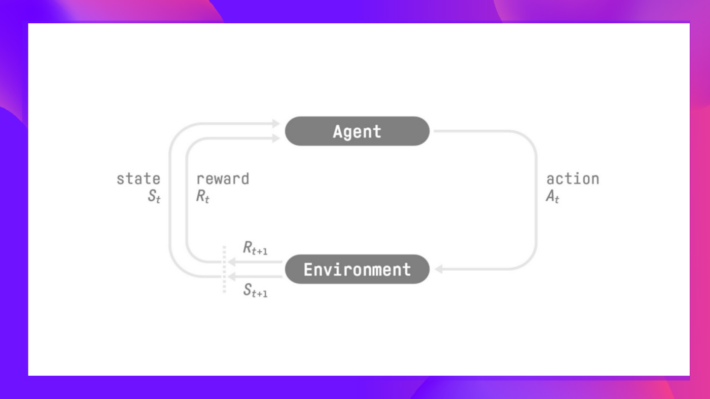

The agent's decision making process is called **policy** $\pi$. Given a state, the policy will outputs an action or distribution of probabilities over actions. It is a mapping of states to actions. The policy is what the agent uses to decide what action to take next. The policy can be either deterministic or stochastic. A deterministic policy always chooses the same action for a given state. A stochastic policy chooses actions at random, but usually with some bias towards actions that are expected to yield higher rewards.

The agent's goal is to learn the optimal policy ($\pi^*$) which maximizes the overall reward. There are two main types of RL methods:

## Policy-based methods 
Train a policy directly to learn which action to take given a state. In this approach, we directly learn the optimal policy and there is no need for a value function. Thus, we don't define by hand the behavior of the policy, it's the training that will define it.

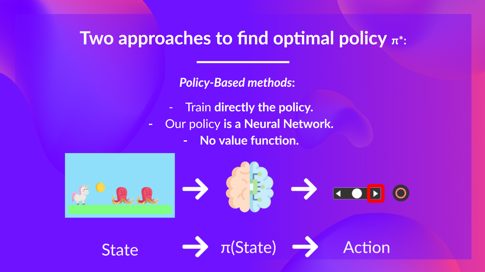
  
## Value-based Methods

Train a value function to learn which state is more valuable and the our policy decides which action to take based on these values. In this approach, we indirectly learn the optimal policy by learning the value function. The value function tells us which states are more valuable than others. Then, we can define a policy that chooses the action that has the highest value for the current state. The advantage of this approach is that it allows us to learn the optimal policy without explicitly searching for it.
  
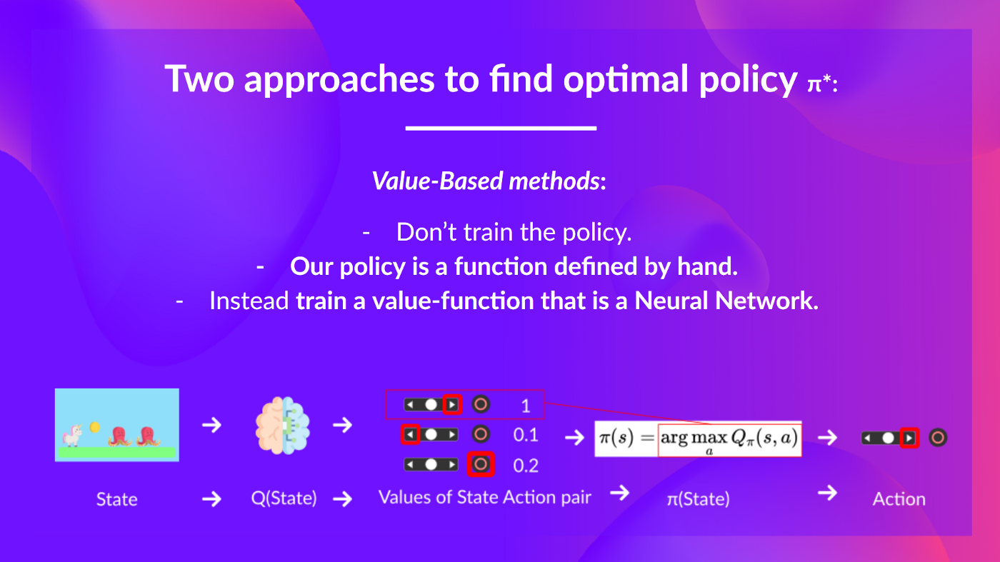

In conclusion,
- Policy-Based Methods: The optimal policy ($\pi^*$) is found by training the policy directly.
- Value-Based Methods: Finding an optimal value function (denoted by $\text{Q}^*$ or $\text{V}^*$) leads to having an optimal policy.
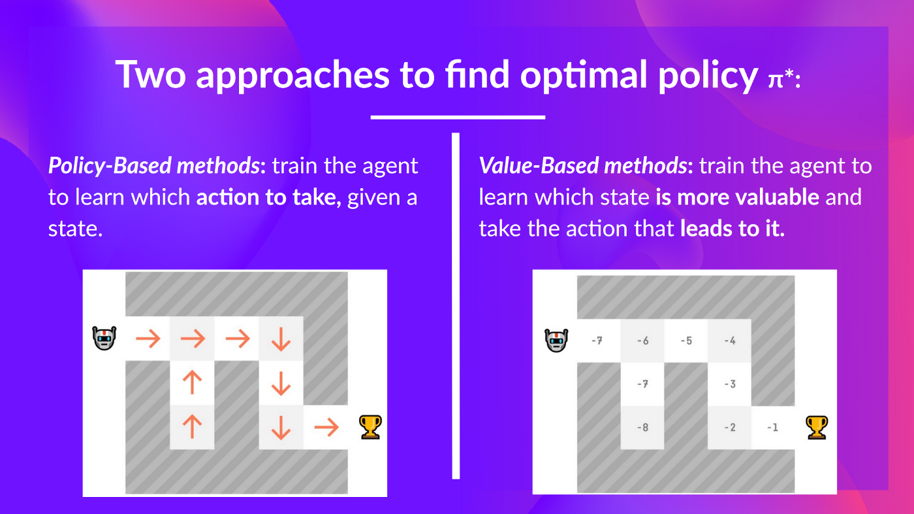

### Value Function
$$V_\pi(s) = \mathbf{E}[R_{t+1} + \gamma R_{t+2} + \gamma^2 R_{t+3} + .. + | S_t = s]$$
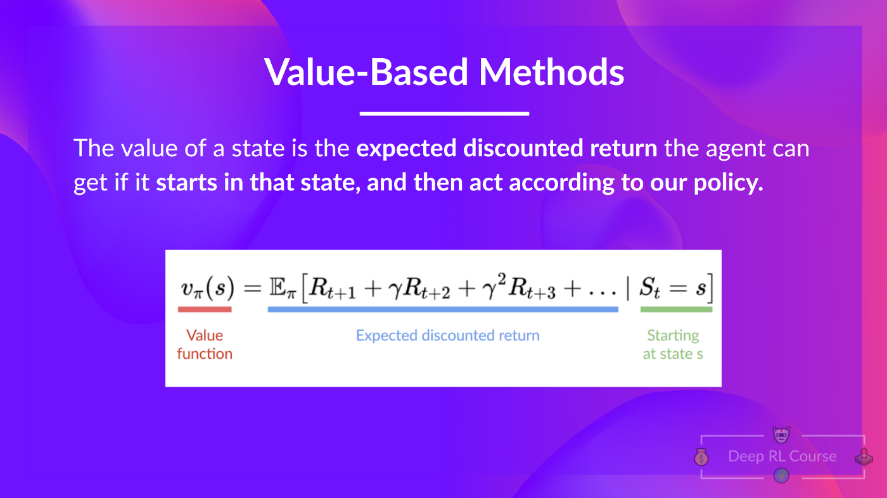
The value function tells us the long-term value of any state $s$ under policy $\pi$. It is the expected return when starting in $s$ and following $\pi$ thereafter. The value of a state $s$ is the total amount of reward an agent can expect to accumulate over the future, starting from state $s$.

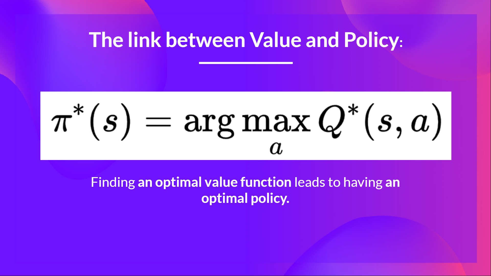

$\pi^*(s) = \text{argmax}_a Q^*(s,a)$

Finding an optimal value function (denoted by $\text{Q}^*$ or $\text{V}^*$) leads to having an optimal policy. The optimal policy is the one that chooses the best action for each state, according to the optimal value function. The optimal value function is the one that returns the highest value for each state.

Most of the time, in value-based methods, we'll use *Epsilon-Greedy Policy* to choose the action. This policy will choose the best action with probability $1-\epsilon$ and a random action with probability $\epsilon$. This allows the agent to explore the environment and discover new states that may lead to better policies and higher rewards.

## Two types of Value-Based Methods

### The State-Value Function $V_\pi(s)$

For each state, the state-value function outputs the expected return for the agent if the agent **starts in that state** and then follows the polic $\pi$ for all future time steps. The state-value function is specific to a given policy. The state-value function for a 
policy $\pi$ is denoted as $V_\pi(s)$.

   
$V_{\pi}(s) = \mathbf{E_\pi}[G_t|S_t=s]$

Let's unpack this equation.
- $V_\pi(s)$ is the value of state s
- $G_t$ is the total discounted reward from time-step t
- $\mathbf{E_\pi}$ is the expected value of following policy $\pi$

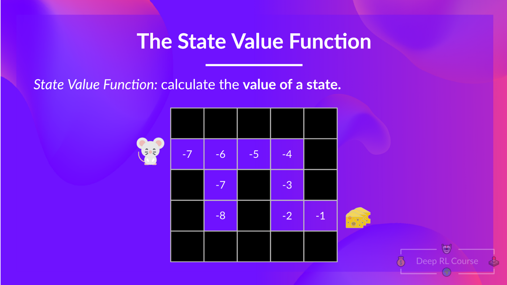

### The Action-Value Function $Q_\pi(s,a)$

In the case of action-value function, for each pair of state and action, the action-value function outputs the expected return for the agent if the agent **starts in that state**, and **takes that action**, and then follows the policy $\pi$ for all future time steps. The action-value function is specific to a given policy. The action-value function for a policy $\pi$ is denoted as $Q_\pi(s,a)$.

$Q_\pi(s, a) = \mathbf{E_\pi}[G_t|S_t=s, A_t=a]$

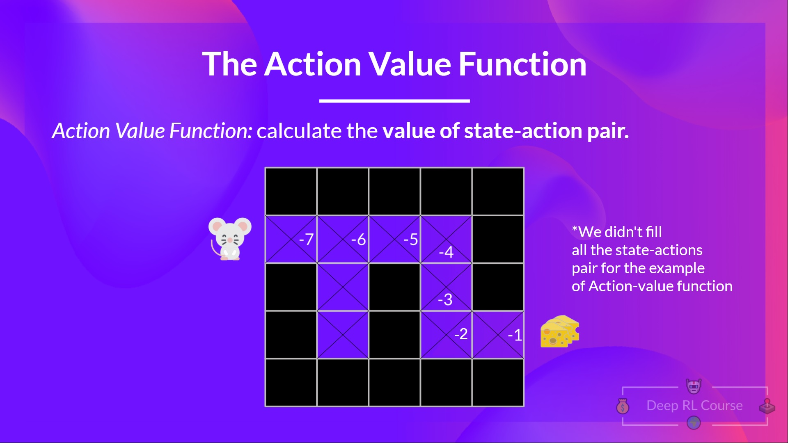

So over all,
- For the state-value function, we calculate the value of the state S_t.
- For the action-value function, we calculate the value of the state-action pair (S_t, A_t), hence the value of taking that action in that state.

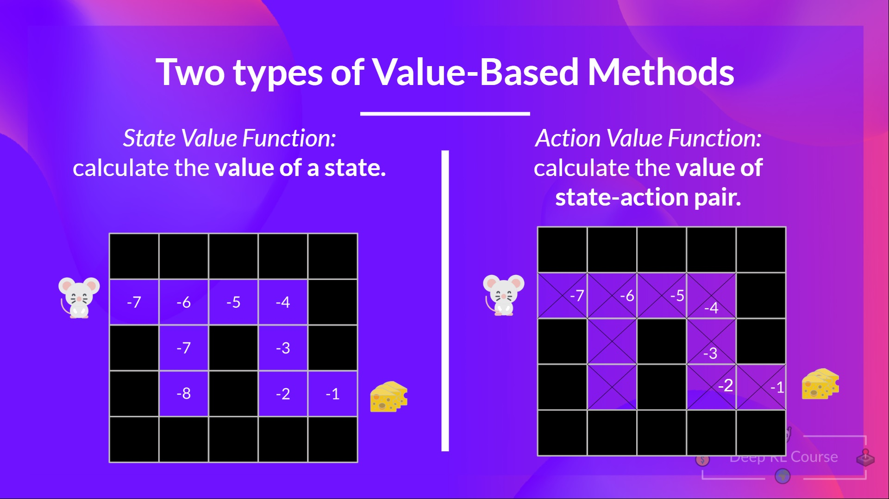

In either case, the returned value is the expected return. The challenge is to calculate **EACH** value of a state or state-action pair, we need to sum all the rewards agent can get if it starts in that state and follows the policy $\pi$ for all future time steps.

## The Bellman Equation
The Bellman equation simplifies our state value or state-action value calculation.

For simplicity, we will use the greedy policy, which means that we will always choose the action that has the highest value for a given state. Also, we'll not discount the rewards, so $\gamma = 1$.

Notice that there is a recursive relation in calculation of state value function (or state-action value function). For simplicity, let's start with value function. The value of a state depends on the values of the next state. The value of the next state depends on the values of the next next state, and so on. Instead of calculating the expected return for each state (or for each state-action pair), We can use the Bellman equation to calculate the value of a state (or state-action pair) based on the values of the next state (or next state-action pair).

$$V_\pi(s) = \mathbf{E_\pi}[R_{t+1} + \gamma V_\pi(S_{t+1})|S_t=s]$$
Let's break this down.
- $V_\pi(s)$ is the value of state s
- $R_{t+1}$ is the reward at time-step t+1
- $\gamma$ is the discount factor
- $V_\pi(S_{t+1})$ is the value of the next state 
- $\mathbf{E_\pi}$ is the expected value of following policy $\pi$
  
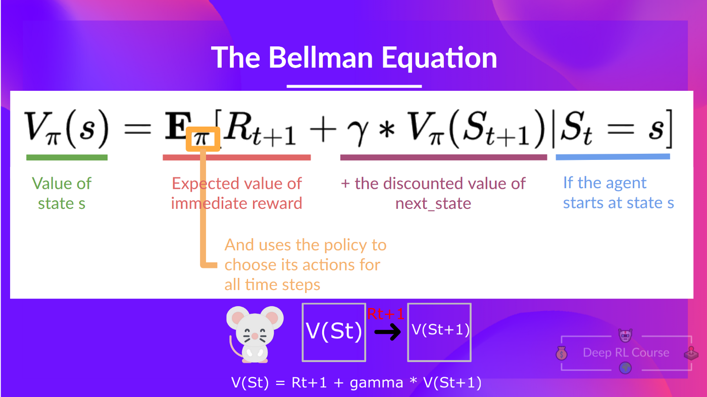

The Bellman equation is a recursive equation that decomposes the value of a state into two parts:
- The immediate reward $R_{t+1}$
- The discounted value of the next state $\gamma V_\pi(S_{t+1})$

Role of gamma in Bellman equation:
- If gamma is 0, the agent will only care about the immediate reward. It will not care about the future rewards.
- If gamma is 1, the agent will care about both the immediate and future rewards equally.
- If gamma is say 1000, the agent will care a lot about the future rewards.

## Monte Carlo vs Temporal Difference Methods
RL agent learns by interacting with it's environment. Given the experience and the received rewards, the agent will update its policy or value function.

Monte Carlo and Temporal Difference methods are two different ways to update the value function or the policy. Both of them use experience to update the value function or the policy.

Monte Carlo methods wait until the return at the end of the episode, then use that return as the target for $V(S_t)$. That is, the Monte Carlo method waits until the end of the episode, then updates the value function based on the total reward for the episode.

$V(S_t) \leftarrow V(S_t) + \alpha [G_t - V(S_t)]$

- $V(S_t)$ is the current estimate of the value of the state
- $\alpha$ is the step size parameter (also known as the learning rate)
- $G_t$ is the actual return following time-step t

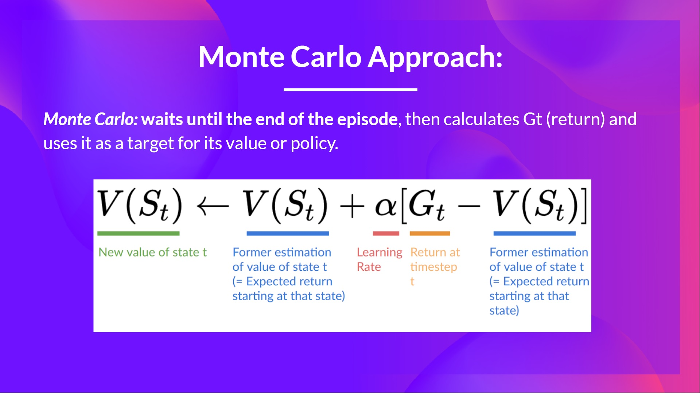

For our example:
 - 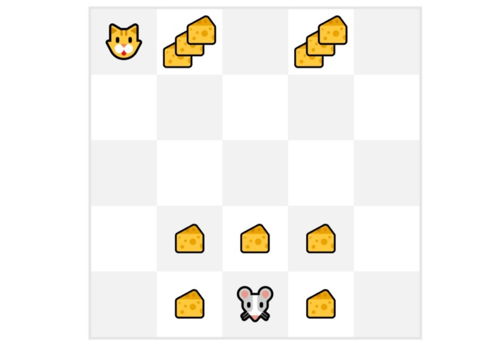
 - We *always* start at the same starting point.
 - The agent takes actions according to the policy. For instsnce, using an Epsilon-Greedy policy, the agent will alternate between exploration (random actions) and exploitation (best actions).
 - We get the reward and the next state.
 - We terminate the episode when the agent reaches the goal or the maximum number of steps is reached. (In this case, if the cat catches the mouse or mouse has moved say 100 steps, we terminate the episode.)
 - At the end of the episode, we have a list of states, actions, rewards and next states tuples (S, A, R, S').
 - The agent will sum all the rewards to get the actual return $G_t$.
 - It will then update the value function $V(S_t)$ (like in the equation above).
 - Then we start a new episode with this new knowledge.
 - By running more and more episodes the agent will learn to play better and bettert.

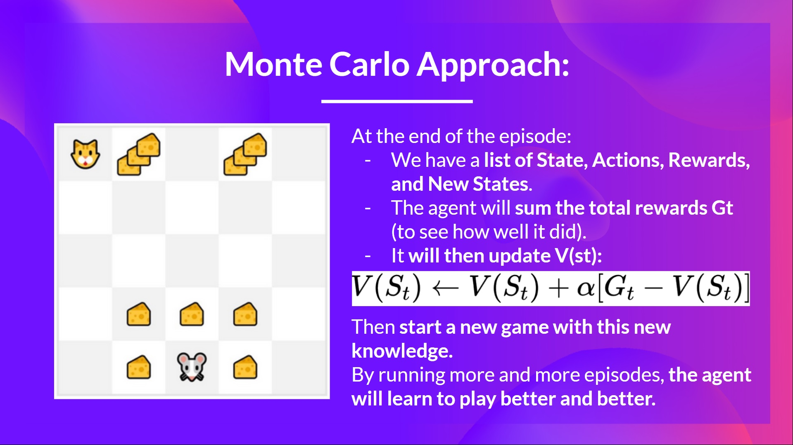

## Temporal Difference Methods
Temporal Difference (TD) methods update the value function after every time-step. TD methods update the value function based on the estimated return $R_{t+1} + \gamma V(S_{t+1})$.

